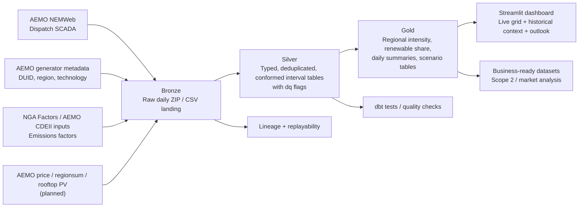

# NEM Emissions Intensity Pipeline

Australia's mandatory climate disclosure regime (Scope 2 reporting under AASB S2) makes granular electricity-emissions data a real business need.

Many businesses are investing into an internal product, or paying suppliers for products that can calculate their emissions from captured metering data.

This data engineering project is designed as the portfolio version of the data platform that Australian energy employers, retailers, consultancies, and sustainability teams are building: 

>The outcome is a dashboard. Backend, github actions every 5 minutes imports dispatch data from AEMO (import_data.py), drop columns, append rows to CSV. 
> https://nemweb.com.au/Reports/Current/Dispatch_SCADA/  
> https://www.dcceew.gov.au/climate-change/publications/national-greenhouse-accounts-factors

> Connect table to 2nd database about genunit fuel type, get DCCEEW workbook for emissions by fuel type. 
https://www.aemo.com.au/energy-systems/electricity/national-electricity-market-nem/nem-forecasting-and-planning/forecasting-and-planning-data/generation-information  
 Filter design connects tables, and calculated emissions from energy output by fuel type.

### Sources: 
https://www.corrs.com.au/insights/australias-data-centre-boom-needs-an-energy-plan

https://www.theguardian.com/environment/2026/mar/02/datacentres-australia-power-prices-water-supply-emissions

https://www.aemo.com.au/-/media/files/stakeholder_consultation/consultations/nem-consultations/2024/2025-iasr-scenarios/final-docs/oxford-economics-australia-data-centre-energy-consumption-report.pdf

## Architecture

## Business framing

###  The core analytical question is:

> How clean or dirty was the NEM, by region and interval, and what does that imply for corporate Scope 2 reporting, renewable timing, and operational load-shifting?

This repo intentionally separates two products:

- `Disclosure-grade emissions analytics`
  Focused on defensible interval-level calculations using generator dispatch, metadata, and emissions factors.
- `Historical context and transition narrative`
  Focused on long-run market context, planning signals, and scenario storytelling.

## Data Usage

The project uses different history horizons for different purposes:

- `FY25-26 operational backfill`
  Raw daily Dispatch SCADA archive ingestion for the current reporting period.
- `Disclosure-grade emissions history`
  Defensible interval-level model from the NGER actual-data era onward.
- `1998+ market context`
  Aggregated long-run context series used for narrative and trend framing, kept separate from disclosure-grade emissions facts.

## Architecture decisions

The key design decisions are documented in:

- [ADR-0001: Use a Medallion architecture for AEMO market data](/Users/tanjimislam/PycharmProjects/realtime_energy_dashboard/docs/adr/0001-medallion-architecture.md)
- [ADR-0002: Use incremental batch ingestion instead of streaming](/Users/tanjimislam/PycharmProjects/realtime_energy_dashboard/docs/adr/0002-batch-over-streaming.md)
- [ADR-0003: Use Parquet and DuckDB for local development](/Users/tanjimislam/PycharmProjects/realtime_energy_dashboard/docs/adr/0003-parquet-duckdb-local-dev.md)
- [ADR-0004: Separate disclosure-grade emissions history from 1998+ market context](/Users/tanjimislam/PycharmProjects/realtime_energy_dashboard/docs/adr/0004-history-boundary-and-comparability.md)

## References

- [AEMO NEM overview](https://www.aemo.com.au/energy-systems/electricity/national-electricity-market-nem/about-the-national-electricity-market-nem)
- [AEMO Electricity data](https://www.aemo.com.au/en/energy-systems/market-it-systems/electricity-system-guides/electricity-data)
- [AEMO Historical data help](https://markets-portal-help.docs.public.aemo.com.au/Content/InformationSystems/Electricity/HistoricalData.htm)
- [AEMO Aggregated data](https://www.aemo.com.au/energy-systems/electricity/national-electricity-market-nem/data-nem/aggregated-data)

