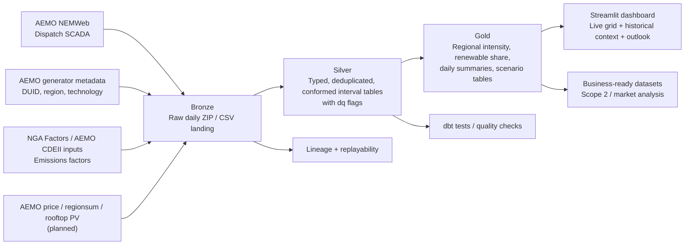

# NEM Emissions Intensity Pipeline

Builds a 5-minute National Electricity Market emissions-intensity pipeline for regional Scope 2 reporting under AASB S2, using AEMO dispatch data, generator metadata, and emissions factors.

## Architecture



## Why this project exists

Australia's mandatory climate disclosure regime now makes granular electricity-emissions data a real business need, not an academic nice-to-have. Large Australian businesses need to explain how emissions vary by region and time of day, while the NEM itself is changing rapidly under the 82% renewables-by-2030 transition narrative.

This project is designed as the portfolio version of the data platform that Australian energy employers, retailers, consultancies, and sustainability teams are actually building:

- ingest raw AEMO market data
- conform it into auditable analytical tables
- calculate regional emissions intensity
- expose business-facing datasets and dashboards

## Business framing

The core analytical question is:

> How clean or dirty was the NEM, by region and interval, and what does that imply for corporate Scope 2 reporting, renewable timing, and operational load-shifting?

This repo intentionally separates two products:

- `Disclosure-grade emissions analytics`
  Focused on defensible interval-level calculations using generator dispatch, metadata, and emissions factors.
- `Historical context and transition narrative`
  Focused on long-run market context, planning signals, and scenario storytelling.

They should not be conflated in the data model or the README.

## Current implementation

What exists in this repo today:

- [app.py](/Users/tanjimislam/PycharmProjects/realtime_energy_dashboard/app.py)
  Streamlit dashboard for live/near-real-time NEM emissions intensity, historical trends, rest-of-day forecast scaffolding, and placeholder long-horizon outlook charts.
- [importdata.py](/Users/tanjimislam/PycharmProjects/realtime_energy_dashboard/importdata.py)
  Incremental importer for AEMO Dispatch SCADA, writing:
  - `data/dispatch_scada_today.csv`
  - `data/dispatch_scada_YYYY-MM.csv`
- [build_duid_lookup.py](/Users/tanjimislam/PycharmProjects/realtime_energy_dashboard/build_duid_lookup.py)
  Builder for DUID metadata used by the dashboard.
- [migrate_to_monthly.py](/Users/tanjimislam/PycharmProjects/realtime_energy_dashboard/migrate_to_monthly.py)
  One-time backfill helper for converting monolithic SCADA history into monthly archives.
- [fetch-aemo-data.yml](/Users/tanjimislam/PycharmProjects/realtime_energy_dashboard/.github/workflows/fetch-aemo-data.yml)
  GitHub Actions workflow that refreshes the SCADA snapshot every five minutes.

## Target repo shape

The repo is being expanded toward this structure:

```text
app/
ingestion/
models/
  bronze/
  silver/
  gold/
tests/
dashboards/
docs/
  adr/
data/
.github/workflows/
```

The current root-level scripts remain in place while the project is migrated into that shape incrementally.

## Data model direction

### Bronze

Raw AEMO source extracts, preserved as received.

Planned sources:

- `DISPATCH_UNIT_SCADA` / `DISPATCH_SCADA`
- `DISPATCHPRICE`
- `DISPATCHREGIONSUM`
- generator registration / exemption metadata
- emissions factor inputs
- rooftop PV actuals

### Silver

Typed and conformed interval tables with data-quality flags.

Planned examples:

- `silver_dispatch_interval`
- `silver_dispatch_price`
- `silver_region_sum`
- `silver_generator_metadata`
- `silver_emissions_factor_versioned`

### Gold

Business-ready models.

Planned examples:

- `fct_regional_emissions_intensity`
- `fct_renewable_share`
- `fct_daily_summary`
- `dim_generator`
- `fct_price_emissions_correlation`
- `fct_scenario_generation_pathway`

## Historical strategy

The project uses different history horizons for different purposes:

- `FY25-26 operational backfill`
  Raw daily Dispatch SCADA archive ingestion for the current reporting period.
- `Disclosure-grade emissions history`
  Defensible interval-level model from the NGER actual-data era onward.
- `1998+ market context`
  Aggregated long-run context series used for narrative and trend framing, kept separate from disclosure-grade emissions facts.

See [Backfill plan](/Users/tanjimislam/PycharmProjects/realtime_energy_dashboard/docs/backfill-plan.md).

## Why Medallion is justified here

The Medallion pattern is used because AEMO market data is:

- fragmented across multiple sources
- revised and corrected over time
- semantically awkward in raw form
- consumed by different audiences with different trust requirements

Bronze preserves reproducibility.
Silver handles typing, conformance, deduplication, and NEM-specific quirks once.
Gold exposes clean analytical outputs for business and dashboard consumption.

For this repo, the implementation target is:

- local development: `Parquet + DuckDB + dbt Core`
- production-shaped design target: `Azure Databricks + Delta Lake`

That matches the Australian energy hiring market while keeping the project achievable and cheap to run.

## Architecture decisions

The key design decisions are documented in:

- [ADR-0001: Use a Medallion architecture for AEMO market data](/Users/tanjimislam/PycharmProjects/realtime_energy_dashboard/docs/adr/0001-medallion-architecture.md)
- [ADR-0002: Use incremental batch ingestion instead of streaming](/Users/tanjimislam/PycharmProjects/realtime_energy_dashboard/docs/adr/0002-batch-over-streaming.md)
- [ADR-0003: Use Parquet and DuckDB for local development](/Users/tanjimislam/PycharmProjects/realtime_energy_dashboard/docs/adr/0003-parquet-duckdb-local-dev.md)
- [ADR-0004: Separate disclosure-grade emissions history from 1998+ market context](/Users/tanjimislam/PycharmProjects/realtime_energy_dashboard/docs/adr/0004-history-boundary-and-comparability.md)

## Running locally

Install dependencies:

```bash
pip install -r requirements.txt
```

Refresh data:

```bash
python importdata.py
```

Run the dashboard:

```bash
streamlit run app.py
```

If you only have a legacy monolithic SCADA file and want monthly archives:

```bash
python migrate_to_monthly.py
```

## Repository roadmap

The next repo-build steps are:

1. Add ingestion scripts for price, regionsum, rooftop PV, metadata, and emissions factors.
2. Create Bronze/Silver/Gold tables under a dbt project.
3. Add tests for quality flags and conformance assumptions.
4. Replace placeholder 2050 visuals with sourced scenario tables.
5. Add Docker Compose and CI around linting, tests, and dbt runs.

See [Repo roadmap](/Users/tanjimislam/PycharmProjects/realtime_energy_dashboard/docs/repo-roadmap.md).

## What I would change at scale

At larger scale this project would move to:

- Azure Databricks with Delta Lake
- orchestrated assets or scheduled DAGs
- source freshness and quality alerts
- formal schema versioning
- SCD handling for generator metadata and emissions factors
- separate semantic layers for:
  - live operations
  - disclosure-grade analytics
  - transition scenarios

## References

- [AEMO NEM overview](https://www.aemo.com.au/energy-systems/electricity/national-electricity-market-nem/about-the-national-electricity-market-nem)
- [AEMO Electricity data](https://www.aemo.com.au/en/energy-systems/market-it-systems/electricity-system-guides/electricity-data)
- [AEMO Historical data help](https://markets-portal-help.docs.public.aemo.com.au/Content/InformationSystems/Electricity/HistoricalData.htm)
- [AEMO Aggregated data](https://www.aemo.com.au/energy-systems/electricity/national-electricity-market-nem/data-nem/aggregated-data)

